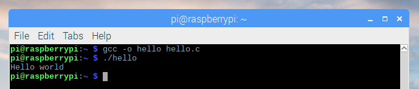

# C

1. Open **Text Editor** from the main menu

1. Enter the following code:

    ```c
    #include <stdio.h>

    int main() {
        printf("Hello world\n");
    }
    ```

1. Save the file as `hello.c` in the home directory

1. Open **Terminal** from the main menu

1. Run the following commands:

    ```bash
    gcc -o hello hello.c
    ./hello
    ```

## Output


