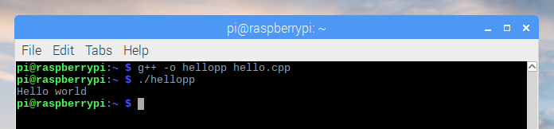

# C++

1. Open **Text Editor** from the main menu

1. Enter the following code:

    ```cpp
    #include <iostream>
    using namespace std;

    int main()
    {
        cout << "Hello world\n";
    }
    ```

1. Save the file as `hello.cpp` in the home directory

1. Open **Terminal** from the main menu

1. Run the following commands:

    ```bash
    g++ -o hellopp hello.cpp
    ./hellopp
    ```

## Output


