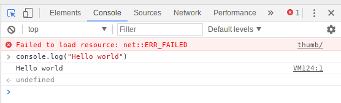

# JavaScript

1. Open **Chromium Web Browser** from the main menu

1. Right-click the empty web page and select **Inspect** from the context menu

1. Click the **Console** tab

1. Enter the following code:

    ```javascript
    console.log("Hello world")
    ```

1. Press **Enter** to run

## Output


