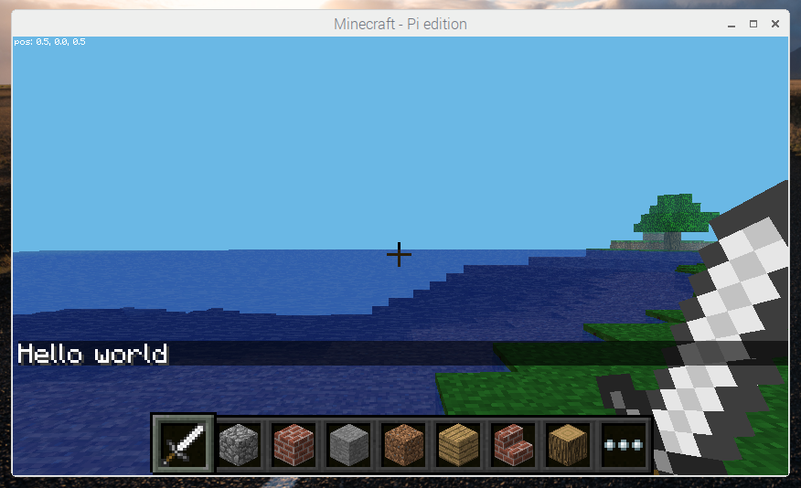

# Python 3

1. Open **Minecraft Pi** from the main menu

1. Create and enter a Minecraft world

1. Press **Tab** to release your focus from the Minecraft window

1. Open **Thonny Python IDE** from the main menu

1. Enter the following code:

    ```python
    from mcpi.minecraft import Minecraft

    mc = Minecraft.create()

    mc.postToChat("Hello world")
    ```

1. Save the file as `hellomc.py`

1. Click the **Run** button

## Output


