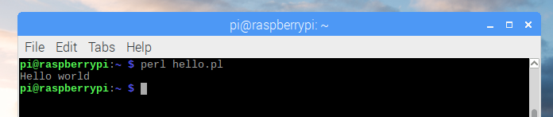

# Perl

1. Open **Text Editor** from the main menu

1. Enter the following code:

    ```bash
    print "Hello world\n"
    ```

1. Save the file as `hello.pl` in the home directory

1. Open **Terminal** from the main menu

1. Run the following command:

    ```bash
    perl hello.pl
    ```

## Output


