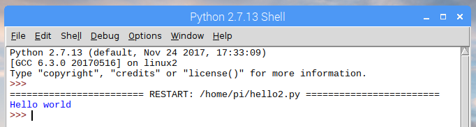

# Python 2

1. Open **Python 2 (IDLE)** from the main menu

1. Click **File** -> **New File**

1. Enter the following code:

    ```python
    print "Hello world"
    ```

1. Save the file as `hello2.py`

1. Click **Run** -> **Run Module**

## Output


