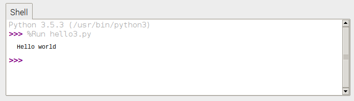

# Python 3

1. Open **Thonny Python IDE** from the main menu

1. Enter the following code:

    ```python
    print("Hello world")
    ```

1. Save the file as `hello3.py`

1. Click the **Run** button

## Output


