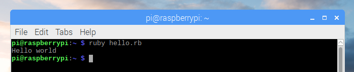

# Ruby

1. Open **Text Editor** from the main menu

1. Enter the following code:

    ```bash
    puts "Hello world"
    ```

1. Save the file as `hello.rb` in the home directory

1. Open **Terminal** from the main menu

1. Run the following command:

    ```bash
    ruby hello.rb
    ```

## Output


