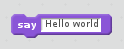
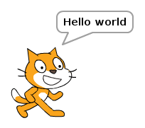

# Scratch 2

1. Open **Scratch 2** from the main menu

1. Click **Looks**

1. Drag a **say Hello!** block into the workspace on the right

    

1. Change the text to `Hello world`

1. Click on the block to run the code

## Output

