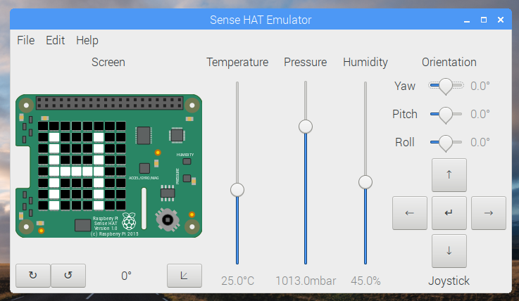

# Sense HAT Emulator

1. Open **Thonny Python IDE** from the main menu

1. Enter the following code:

    ```python
    from sense_emu import SenseHat

    sense = SenseHat()

    sense.show_message("Hello world")
    ```

1. Save the file as `sense.py`

1. Click the **Run** button

## Output


