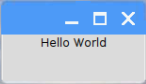

# Tkinter (Python 3)

1. Open **Thonny** from the main menu

1. Click **File** -> **New File**

1. Enter the following code:

    ```python
    from Tkinter import *
    root = Tk()
    root.geometry("150x50")
    Label(text="Hello World").pack()
    root.mainloop()
    ```

1. Save the file as `tkinter2.py`

1. Click **Run** -> **Run Module**

## Output


