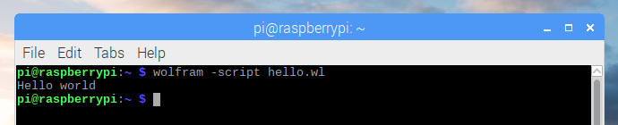

# Wolfram Language

1. Open **Text Editor** from the main menu

1. Enter the following code:

    ```mathematica
    Print["Hello world"]
    ```

1. Save the file as `hello.wl` in the home directory

1. Open **Terminal** from the main menu

1. Run the following command:

    ```bash
    wolfram -script hello.wl
    ```

## Output


